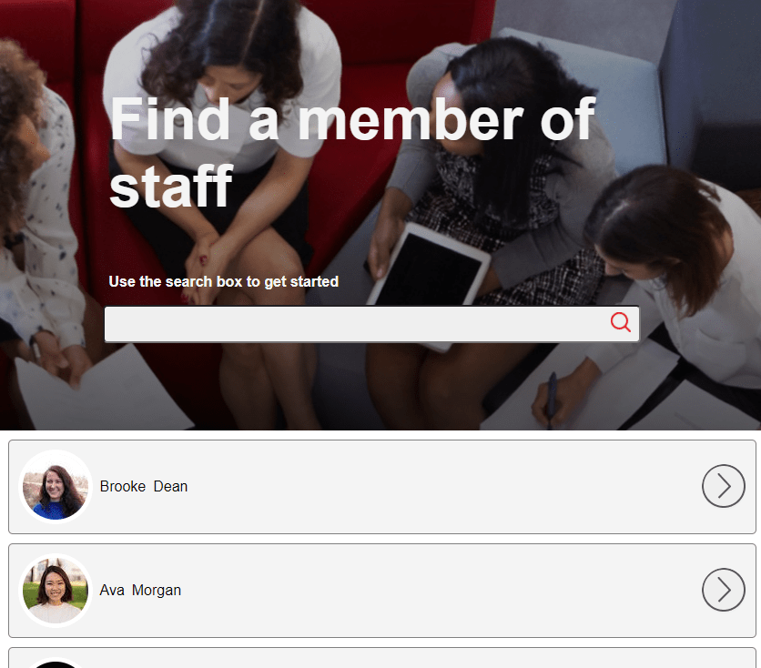

# Staff search react application

A mock staff search set of components built using hooks and the random user api [randomuser.me](https://randomuser.me/) to supply mock data. 

Demo hosted [here](https://priceless-lamarr-9fe25e.netlify.app/)

**Functional description**

- On page load, 10 random profiles showing their avatar and name should be listed.
- These profiles can be filtered by their name with the text input.
- When clicking one of the profile items, this will open a modal displaying further information on the user.
- The components are responsive at all screen sizes within chrome.

#Packages 

###[React-Modal](https://reactcommunity.org/react-modal/) 
was used to display further user information once an individual user had been selected

###[Framer motion](https://www.framer.com/motion/)

An animation library for react with unlimited potential, I've used this for simple hover effects within the User component on each tile. In future when I have time I'd like to experiment further with whats possible with this library.

Below is animated example of the affect achieved.

